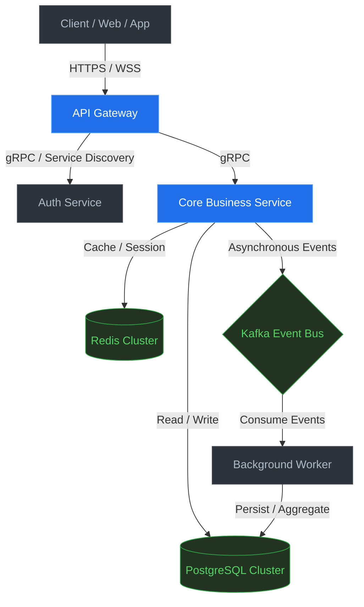
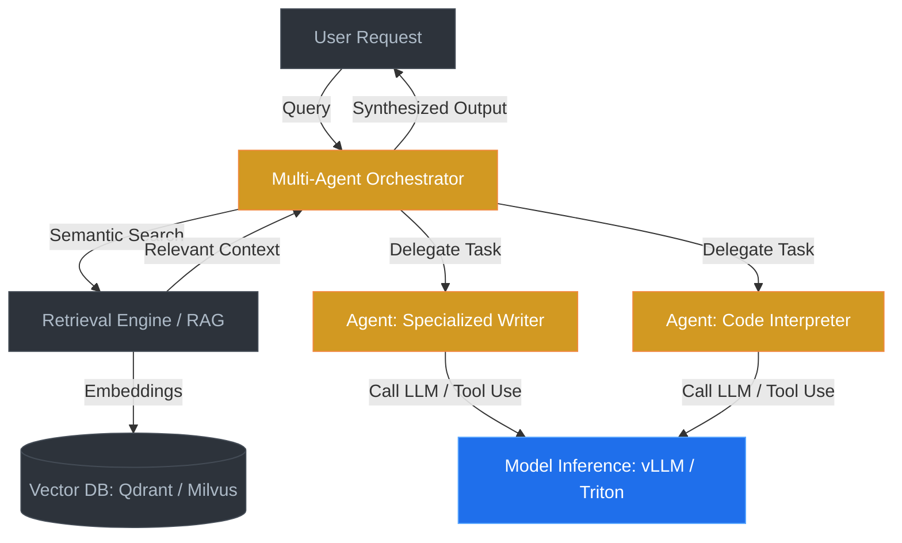

# Hi, I'm Planckbaka 👋

Backend Engineer specializing in **Go/Python Cloud Services** and **AI Infrastructure**. Currently focus on high-performance model serving, distributed systems, and intelligent multi-agent architectures.

  

---

## 🛠 Technical Competency Matrix

| Category | Technologies, Frameworks & Concepts |
| :--- | :--- |
| **Go Backend & Cloud Native** | Go • Gin • gRPC • Protobuf • Kafka • Redis • PostgreSQL • Docker • Kubernetes • AWS • Clean Architecture • DDD |
| **AI Infra & Model Serving** | PyTorch • vLLM • Ollama • Triton Inference Server • GPU Scheduling & Optimization • CUDA & Core Acceleration |
| **AI Agent & LLM Engineering** | LangChain / LangGraph • LlamaIndex • Vector Databases (Qdrant / Milvus / Chroma) • RAG • Multi-Agent Orchestration • Fine-Tuning |
| **Modern Fullstack (Secondary)** | React • Next.js • TypeScript • Tailwind CSS • Redux / Zustand |

---

## 🌟 Flagship Architectures & Core Showcases

### 1. High-Concurrency Go Microservice System Architecture
A robust, highly decoupled enterprise backend system engineered with Go, leveraging **Clean Architecture** and **Domain-Driven Design (DDD)** principles to ensure maintainability and high scalability.

### 2. Autonomous Multi-Agent & RAG Platform Flow
An intelligent LLM orchestration framework coordinating multiple specialized agents. It integrates advanced semantic search over vector stores and dynamically maps tasks to specialized workflows.

---

## 🔭 Active Research & Roadmap

* **Inference Optimization:** Benchmarking and optimizing LLM serving latency with `vLLM` and `Triton Inference Server` across heterogeneous GPU clusters.
* **Intelligent Agents:** Investigating multi-agent consensus protocols and durable state management in complex, long-running agent workflows (LangGraph).
* **System Rigor:** Implementing Domain-Driven Design (DDD) patterns in high-throughput Go microservices using clean architectural boundaries.

---

## 📈 Activity & Stats

  
  

---

## 📫 Connect with Me

* **Email:** [akiwayne24@gmail.com](mailto:akiwayne24@gmail.com)
* **Blog:** [Planck's Space](https://blog-pearl-iota-29.vercel.app/)
* **Location:** Shanghai, China 🇨🇳
